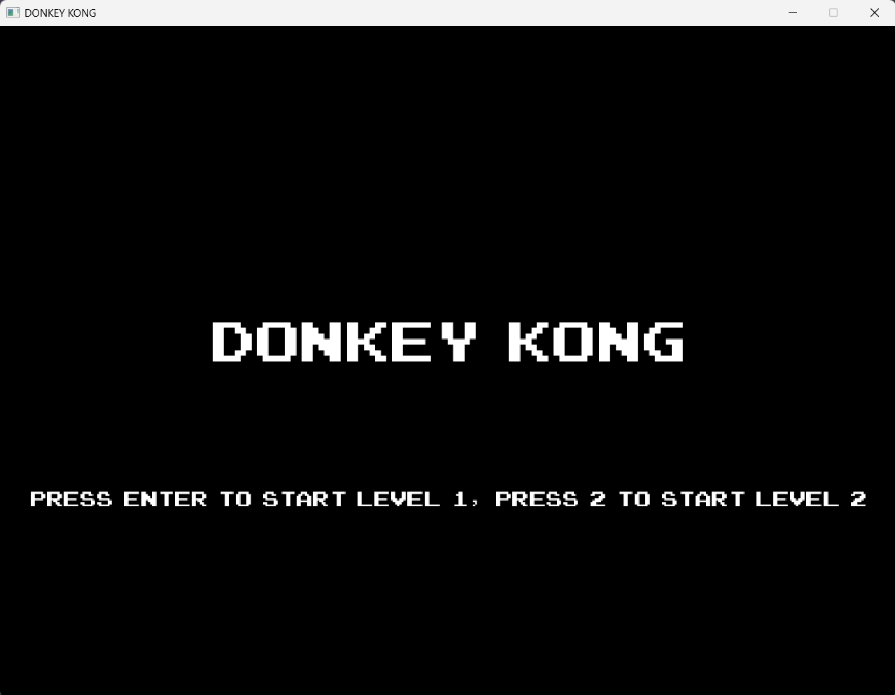
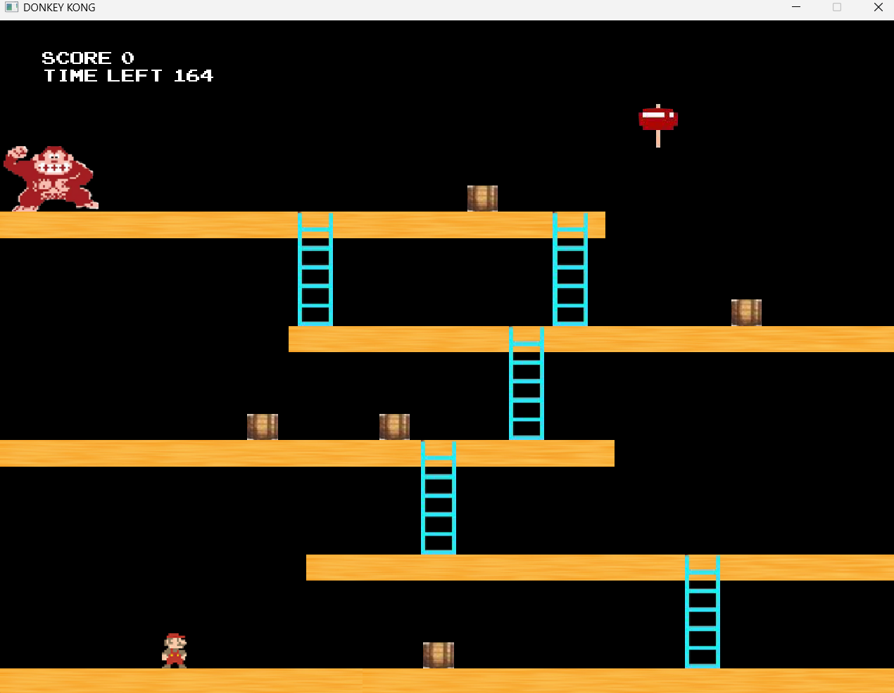
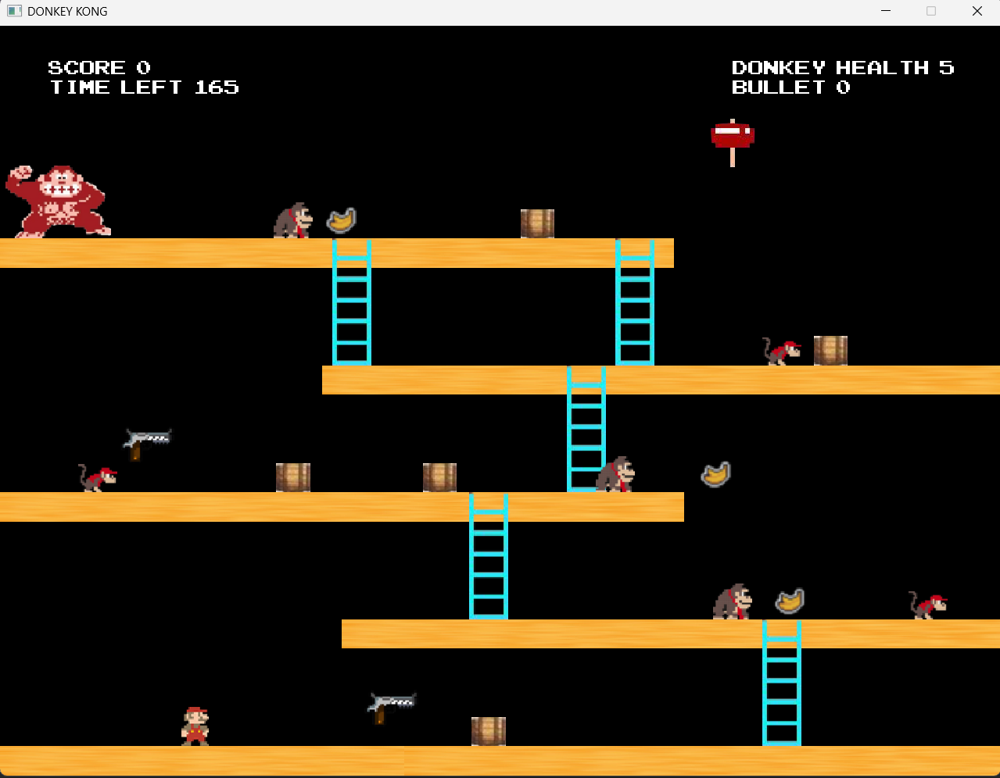
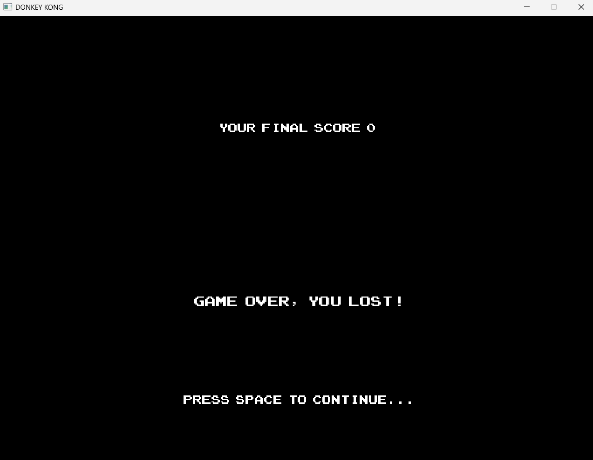
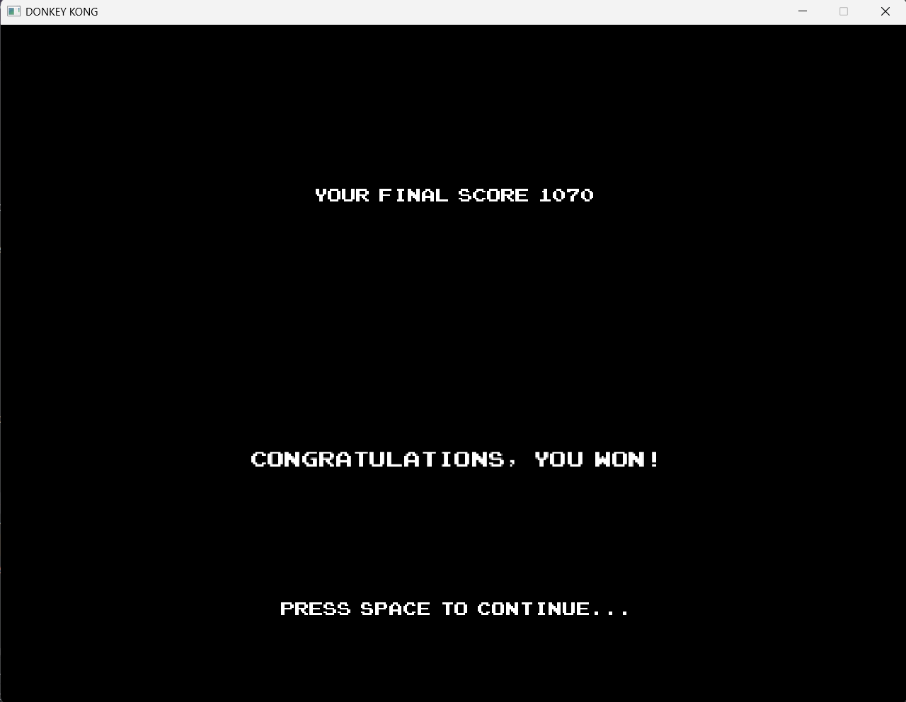

# **Shadow Donkey Kong - Game Guide**

## **📌 Overview**
This document provides an overview of the **Shadow Donkey Kong game**

This was a project for SWEN20006 Object Oriented Programming at The University of Melbourne. It uses Bagel (Basic Academic Graphical Engine Library), 
a custom graphics package for Java created by subject staff, and MAVEN for build management.

---

## **🎮 Shadow Donkey Kong Game Guide**
Shadow Donkey Kong is a classic platformer where players control **Mario** to navigate obstacles, climb ladders, jump on platforms, and defeat Donkey Kong using a hammer. The game features:
- **Platform mechanics**: Mario can walk, jump, and land on platforms.
- **Ladder climbing**: Mario can climb up and down ladders.
- **Hammers**: Mario can pick up a hammer to defeat Donkey Kong.
- **Time-based challenge**: The level must be completed within a time limit.

### **🔹 How to Play**
1. **Start the game**: Run the game (run **./src/ShadowDonkeyKong.java**) and begin on the home screen.
2. **Move Mario**: Use the arrow keys to move left, right, and jump.
3. **Climb ladders**: Approach a ladder and press the UP or DOWN key.
4. **Use a hammer**: Pick up a hammer to defeat Donkey Kong.
5. **Use a blaster**: Pick up a blaster and press 'S' to fire
6. **Survive**: Avoid monkeys and bananas shot.
7. **Win the level**: Reach Donkey Kong while holding a hammer before time runs out.

---

## **Images**
### Start Screen

Level 1                   | Level 2
:-------------------------:|:-------------------------:
  |  

Game Lost                    | Game Won
:-------------------------:|:-------------------------:
  |  

#### **Extra documentation**
Whilst my implementation of Project 2B is based of my implementation of Project 1, there are still some minor changes.
Instead of using arrays to store game objects, array lists have been used as they are much more flexible. I've also
seperate methods into helper methods to improve the clarity of code. In the main ShadowDonkeyKong class, instead of 
implementing all the game logic in the update method, I've created helper methods to render objects and characters
and handle interaction logic. This makes the update method a lot more straight-forward and less cluttered.

**Level 1 (from Project 1)** 

Note that in the game, if mario is half-way up a ladder and moves off this ladder.
Mario is then able to intersect into this platform, and still fall down, essentially falling
through this platform.

It is also assumed that the maximum jump height of mario will be 62.5 pixels upwards, which
is used to see if mario jumps of a barrel or not.

Since the way that mario gains points for jumping over a barrel had some ambiguity in the project
requirements, the way this game defines is mario gains points as soon as he passes over the
central x value of a barrel (whilst being under the maximum jump height over this barrel).
This means that mario is able to jump over a barrel to gain the points, immediately change
direction to go back the other way and gain the points again.

If the user loses the gain by running out of time, there will be no bonus time points.
Mario cannot exceed the edges of the screen, however due to the x and y co-ordinates of this game
being based off the centre of an entity, if mario goes all the way to the edge, half of his character
will seem to be off the screen, however he will not be able to walk any further.

Essentially, this means that the centre of mario will not be able to exceed the edges of the screen.
Note that we do not check if Mario passes through the top and bottom of the Window, as we
make the reasonable assumption that this will not happen in a real game situation.

All data, where possible, is being read dynamically from the app properties and message properties file.
A collision error of 4 has also been defined, so that when certain entities are falling at a
fast velocity, they won't glitch through any platforms.

If Mario has the hammer and is currently climbing up a ladder, if there is a barrel on that top
platform positioned close enough to the ladder, Mario is able to destroy that barrel whilst
he is climbing up that ladder, essentially destroying it through the platform.

**Level 2 (New to Project 2B)**

I've made the assumption that there will always be a platform at the bottom of the edge which prevents 
objects and characters falling through. Also that characters will never be able to exceed the top edge
of the window.

Upon moving onto level 2, the score from level 1 is kept and no time bonus is added for this, however 
the time for level 2 also resets. The time bonus is then calculated with the time remaining in level 2.

I've also made the reasonable assumptions, according to game requirements, that monkeys (normal and 
intelligent), blasters, bananas, bullets will only exist in Level 2.

When mario is holding a weapon, and he picks up a NEW weapon, his image will be automatically updated
upon picking up this new weapon, to represent that the previous weapon has been replaced.

Projectiles will also keep travelling if they are outside a window, because it won't matter as they
will not hit anything, and will be destroyed after travelling the maximum distance anyway.

For monkeys travelling their paths, there is an assumption that if the remaining distance is less than the
travel speed (pixels / frame), this remaining distance is skipped.
For example if a monkey travels 1 pixel per frame, however it has to travel 0.5. The 0.5 will be skipped.

Due to the images for bullets and monkeys, if mario shoots a bullet at a monkey while on a ladder, it
is possible that the bullet will travel through the platform and connect with the monkey

Note that once a banana has been shot, it will keep travelling regardless of it the monkey that shot the banana
is destroyed or not. 